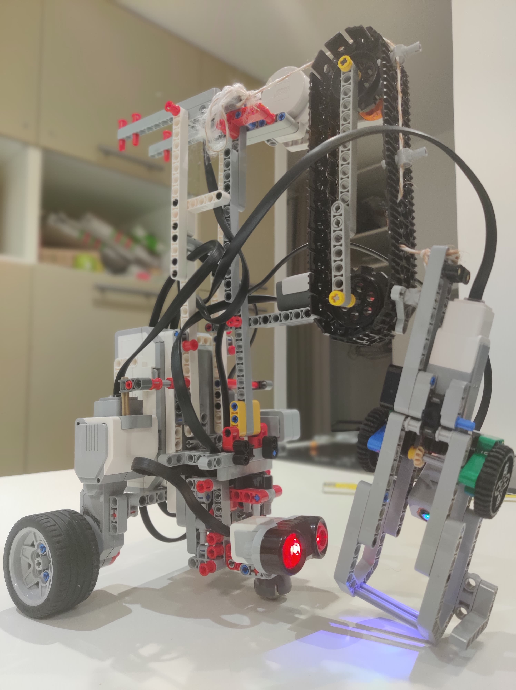
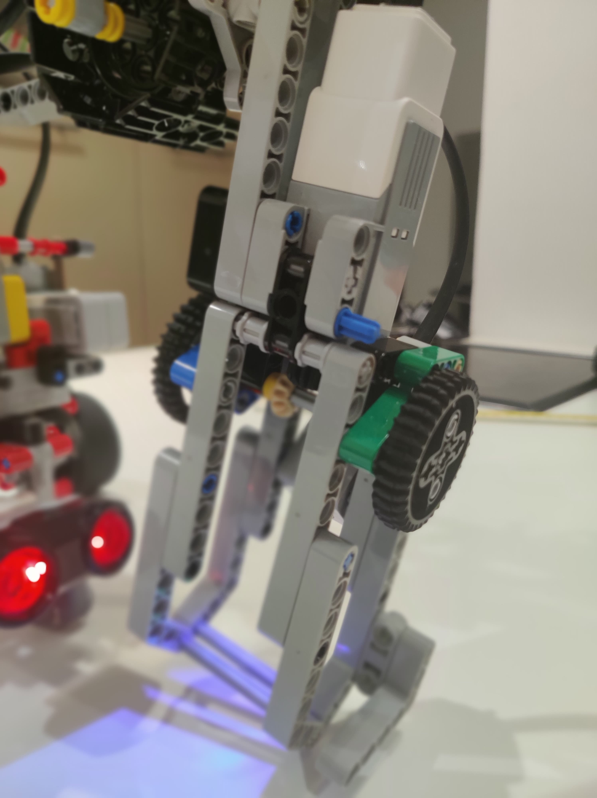
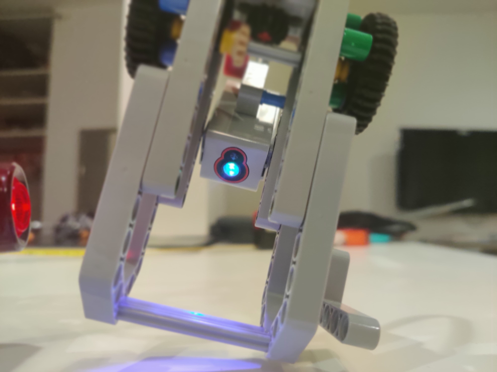
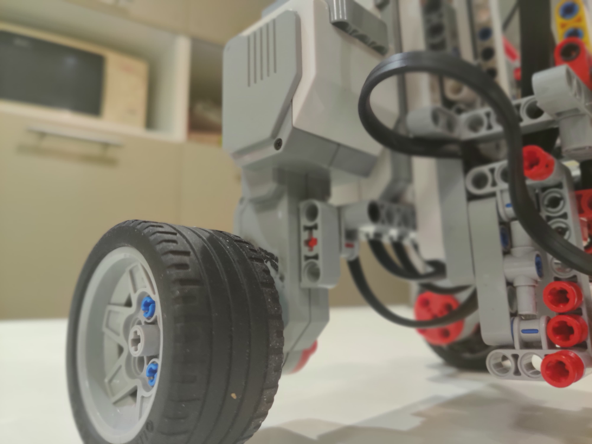

This project consist of programming a _LEGO MINDSTORMS EV3_ robot to complete the **warehouse** challenge : grabbing balls in a box and moving them to a given destination. 

It is a challenge for our OS course at [Eurecom](https://www.eurecom.fr/). Here are our team members : 
* Florian Le Mouël
* Mathieu Champion
* Virgile Retault

## Description of the robot



The robot has active independant wheels and is controlled with a differential drive. A third passive wheel is used to stabilize it.  
Tacheometry and sensor fusion is used to determine its position at all time.

A large claw that's about the width of the cube is used to grab the balls and is mounted on a crane-like structure to raise and lower it. 



### Sensors

* Magnetic sensor (compass)
    - Used to compute the absolute rotation
* Gyroscope sensor
    - Used to measure the relative rotation, fused with the compass
* Ultrasonic sensor (distance sensor)
    - Used to measure the distance of the robot to objects to help with positioning
* Color sensor in the claw
    - Used to tell if a ball has been succesfully picked up or not



### Actuators

* Two motors for the wheels
* One motor to open and close the claw 
* One motor to lower and raise the claw



## Algorithms

### Move precisely 

#### Basic Control

The robot moves using a differential drive with direct control over the motor's duty cycle. Turning the left motor with a higher duty cycle than the right motor will make the robot curve to the right, and turning the right motor with a higher duty cycle than the left motor will make the robot curve to the left.  
Turning the left motor in reverse from the right motor is used to make the robot turn in place.

Here is the algorithm to face a target :  
```C
start_motors();

do {
    update_rotation();
    angle = angle_between_robot_and_target();

    if(angle>0) {
        set_motors_duty(-DUTY, DUTY);
    } else if(angle<0) {
        set_motors_duty(DUTY, -DUTY);
    }
} while(abs(angle)>ANGULAR_PRECISION);

stop_motors();
```

And the algorithm to go to a target :
```C
void move_to(Vector target) {
    set_motors_duty(DUTY, DUTY);
    start_motors();

    while(distance(target, robot_pos)>=PRECISION) {
        update_rotation();
        update_position();

        angle = angle_between_robot_and_target();

        if(angle < 0) { // Turn Right
            set_motors_duty(DUTY, DUTY-SMALL_CONSTANT);
        }
        else if(angle > 0) { // Turn Left
            set_motors_duty(DUTY-SMALL_CONSTANT, DUTY);
        }
        else { // Go Straight
            set_motors_duty(DUTY, DUTY);
        }
    }

    stop_motors();
}
```

#### Position computation

To update the position of the robot, we first read the position of the encoder of the motors and convert that to a linear distance. Then we take the mean distance of the two wheels to compute the distance travelled by the robot.

Here is the corresponding C pseudo-code :
```C
//Get encoder positions
l = get_left_wheel_encoder_position();
r = get_right_wheel_encoder_position();

//Calculate linear travelled distance of each wheels
SR = ((r-right_wheel_previous_pos)*WHEEL_CIRCUMFERENCE)/360.0;
LR = ((l-left_wheel_previous_pos)*WHEEL_CIRCUMFERENCE)/360.0;

//Update last positions
right_wheel_previous_pos = r;
left_wheel_previous_pos = l;

//Compute mean distance
distance = (SR+LR)/2;

//Add travelled distance to robot position
Vector motion = {meanDistance*cos(radians(robot_pos.rotation)), meanDistance*sin(radians(robot_pos.rotation))};
robot_pos.p = vector_add(robot_pos.p,motion);
```

#### Rotation computation

To compute the rotation, we use fuse the data from the gyroscope and the compass. Here `GYRO_TRUST_RATIO = 0.95`, which means we only trust the position given from the compass at 5%. This allows to compensate the gyro drift.

```C
k = GYRO_TRUST_RATIO;
//Get the amount of rotation given by the gyro since last call
gyro_rot = get_gyro_delta(); 
//Get rotation given by the compass
compass_rot = get_orientation();
//Add gyro rotation to robot rotation
robot_pos.rotation += gyro_rot;
//Fuse in the compass data
robot_pos.rotation = (robot_pos.rotation*k) + (compass_rot*(1.0-k));
//Make sure the angle is between 0 and 360
robot_pos.rotation = robot_pos.rotation%360;
```

### Pickup ball

To pick up the ball, the robot must first ensure that the hand is above the cube. In other words, it needs to be close enough to an edge of the cube, facing the cube.

```C
lift();
close_hand();
int distance_a_atteindre = 50; //
int current_distance = get_distance();
while(current_distance > distance_a_atteindre && (current_distance - distance_a_atteindre > 20)  ){
  if(current_distance == 2550) {break;} //pcq des fois y'a un bug
  printf("distance du cube : %d\n",current_distance );
  foward((double) (current_distance - distance_a_atteindre));
  current_distance = get_distance();
  Sleep(500);
}
```

Once in position, it can try to grab something in the cube, but the attempt may be unsuccessful. In that case, it will pull the cube in an energic movement in order to move its content and, hopefully, the next attempt will be successful. Since it is a little stubborn, it will try endlessly until it catches something. (lower_half brings the hand to a mid-height position; if the hand is at it's lowest position, it raises the hand rather than lowering it)

```C
grab();
while (!is_ball_in_hand()){
	open_hand();
	lower_half();
	coup_vener();
	sleep(1);
	lower();
	close_hand();
}
lift();
```

### Place ball 

Placing the ball is rather similar to grabing it. In this case however, we expect a more precise precision before dropping the ball. Since we drop it in the pyramid, the hand must be right above the center of it. Once we are place, we can drop the ball.

```C
close_hand();
int distance_a_atteindre = 50; //
int current_distance = get_distance();
while(current_distance > distance_a_atteindre ||  current_distance < (distance_a_atteindre - 10)){
  if(current_distance == 2550) {break;} //pcq des fois y'a un bug
  printf("distance du cube : %d\n",current_distance );
  if(current_distance > distance_a_atteindre){
    foward((double) (current_distance - distance_a_atteindre));
  }else {
    aller_tout_droit(-500);
  }
  current_distance = get_distance();
  Sleep(500);
}

printf("distance du cube : %d\n",current_distance );

open_hand();
```

### Find random cube

In order to find the random cube, the robot rotates to face a given set of positions. If it finds an obstacle closer than a threshold distance, it will interpret it as being the random cube.

```C
int distance_attendue = 17000;
bool cubeFound = false;
int posRech[6][2] = { {110 , 80}, {100 , 80}, {90 , 80}, {30 , 60}, {20 , 60}, {10 , 60} };
int i = 0;
while(!cubeFound){
  printf("x : %d, y : %d\n", posRech[i][0],posRech[i][1]);
  sleep(1000);
  Vector newSpot = {posRech[i][0],posRech[i][1]};
  printf("on move vers le new spot\n");
  move_to(newSpot);

  Vector rotat = {80 , 0};
  printf("test");
  rotate_to(rotat);

  printf("distance detectée : %d\n, distance attendue : %d",get_distance(), distance_attendue );
  if (get_distance() < distance_attendue){
    printf("CUBE FOUND !\n");
    cubeFound = true;
  } else {
    i++;
    if(i == 6){
      printf("CUBE NOT FOUND !\n");
      return 0;
    }
  }
  if (cubeFound) {
    return 1;
  }
```

## Source code

The C sourcecode is avaliable on [GitHub](https://github.com/g33kex/GLaDOS). Headers are in the `include` folder and sources in the `src` folder.

To download the source code, please use :
```bash
git clone https://github.com/g33kex/GLaDOS.git
git submodule update --init --recursive
```

### Compilation Instructions

The software can be compiled directly from the robot, or cross-compiled from another computer. When cross-compiling, make sure you have [Docker](https://www.docker.com/) installed and running. 

Whether you're compiling from the robot or cross-compiling, the procedure is the same : 
```
make
```

The executable will be located in `bin/GLaDOS`. You can copy it to the robot manually, or automatically using `make install` if you have properly configured an ssh connection to the robot named `robot`. 

### Usage Instructions

Many tests and manual operations can be performed, please see `./GLaDOS help` for help. For instance, to run the full simulation, one must use `./GLaDOS main`. In case of an error, to immediatly stop the motors you can use `./GLaDOS stop`. 

## Task repartition

In the source code, functions are defined in the headers (`.h`) files in the `include` folder. The author of each functions is indicated with the `@author` flag. 

- Florian : robot physical assembly and testing
    * Installed the OS and initial software on the robot
    * Took care of the physical assembly and design of the robot
    * Implemented basic APIs to manipulate the hand more intuitively
    * Worked on the grab and place functions
    * Carried out the testing and debugging of the robot
- Mathieu : high level functions and sensors
    * Set up the sensors and the interfaces to them
    * Made the procedure to find the random cube
    * Worked on the procedure to pickup the ball from the code
    * Worked on the procedure to place the ball in the code/pyramid
    * Effected the final debugging of the robot
- Virgile : motion system and integration
    * Did the Makefile, code structure, and integration
    * Took care of the motion system
    * Made a Vector library to support the motion system
    * Made the function that uses Tacheometry to update the robot's position
    * Made the function that uses sensor fusion of the compass and gyro to update the robot's rotation
    * Made a motion procedures to move the robot to a precise position and rotation

## Gallery

    
  
